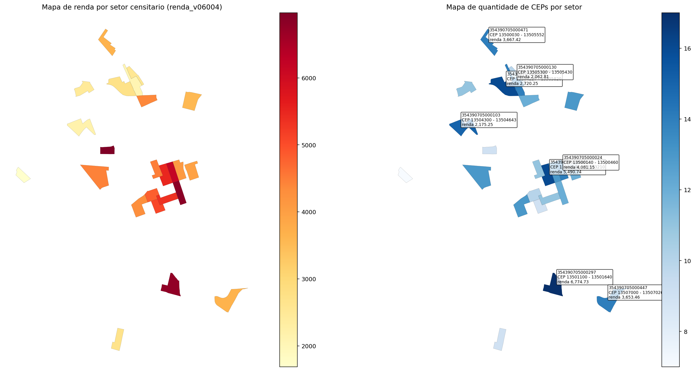

# Pipeline do Zero: CNEFE bruto -> setor censitario + CEP + renda

Este repositorio foi preparado para publicar uma versao enxuta, reproduzivel e facil de entender da pipeline do notebook [`notebooks/pipeline_do_zero_cnefe_setor_cep_renda.ipynb`](notebooks/pipeline_do_zero_cnefe_setor_cep_renda.ipynb).

Aqui entram somente:

- 1 notebook principal
- uma amostra pequena de dados reais de `Rio Claro/SP`
- um README didatico

O objetivo e mostrar como a pipeline funciona de ponta a ponta sem depender de dezenas de gigabytes de dados brutos.

## O que este repositorio entrega

- Um notebook pronto para executar a amostra publicada.
- Uma mini-base de entrada com:
  - `CNEFE` de `SP`
  - agregado de renda por setor
  - shapefile reduzido dos setores usados no exemplo
- O output final ja gerado para validacao rapida.
- Um mapa de saida salvo em PNG para documentacao.

## Estrutura do repositorio

```text
pipeline_do_zero_publicacao/
  README.md
  .gitignore
  notebooks/
    pipeline_do_zero_cnefe_setor_cep_renda.ipynb
  sample_data/
    pipeline_do_zero_mapas_sp.png
    pipeline_do_zero_result_manifest.json
    pipeline_do_zero_result_metricas.csv
    pipeline_do_zero_result_preview.csv
    pipeline_do_zero_result_top_setores.csv
    pipeline_do_zero_amostra/
      manifest.json
      Agregados_por_setores_renda_responsavel_BR_csv/
      BR_setores_CD2022/
      saida_cnefe_uf/
      saida_setor_cep_renda_do_zero/
```

## Como rodar

### 1. Criar o ambiente

Recomendacao: Python `3.11+`.

```powershell
python -m venv .venv
.venv\Scripts\Activate.ps1
pip install pandas pyarrow geopandas matplotlib jupyterlab
```

### 2. Abrir o notebook

```powershell
jupyter lab
```

Abra o arquivo:

- [`notebooks/pipeline_do_zero_cnefe_setor_cep_renda.ipynb`](notebooks/pipeline_do_zero_cnefe_setor_cep_renda.ipynb)

### 3. Executar tudo

Use `Run All`.

Nesta publicacao, o notebook ja esta configurado para abrir a amostra versionada em:

- `sample_data/pipeline_do_zero_amostra`

Entao a execucao padrao ja roda o exemplo de `Rio Claro/SP` sem precisar baixar nada extra.

## O que a pipeline faz

A ideia central do codigo e transformar registros brutos de enderecos em uma base analitica no grao:

`setor censitario + CEP + renda`

Em termos praticos, o notebook faz 6 etapas:

1. Localiza a pasta de trabalho e define onde estao as entradas e saidas.
2. Carrega a tabela de renda por setor censitario.
3. Carrega atributos territoriais do shapefile dos setores.
4. Le o CNEFE bruto em chunks para evitar estouro de memoria.
5. Normaliza e agrega os enderecos no nivel `cd_setor + CEP + logradouro`.
6. Consolida o output final no nivel `cd_setor + CEP`, junta a renda e gera tabelas de validacao e mapas.

## A logica de programacao, em linguagem simples

### 1. O `cd_setor` e a chave central

Quase toda a pipeline gira em torno do codigo do setor censitario. Ele funciona como o elo entre:

- os enderecos do `CNEFE`
- a geometria do setor
- os agregados de renda

Sem essa chave, o endereco nao conversa com o territorio nem com a renda.

### 2. O notebook usa leitura em partes

O arquivo bruto do `CNEFE` pode ficar muito grande. Por isso, o notebook nao tenta carregar tudo de uma vez em memoria. Em vez disso:

- le blocos de linhas
- limpa os campos importantes
- reduz para o que interessa
- agrega aos poucos

Essa estrategia deixa a pipeline mais segura para maquinas comuns.

### 3. O SQLite entra como area de trabalho

Em vez de depender so de `DataFrame` gigantes, o notebook monta tabelas intermediarias em `SQLite`.

Isso ajuda em tres coisas:

- guardar resultados parciais
- criar indices para acelerar consultas
- exportar o resultado final sem precisar manter tudo em RAM

### 4. O primeiro agregado importante e `setor + CEP + logradouro`

O CNEFE vem muito granular, praticamente endereco a endereco. O notebook primeiro resume isso para:

- qual setor contem aquele logradouro
- qual CEP esta associado
- quantos enderecos cairam nesse agrupamento

Depois, ele sobe um nivel e consolida para `setor + CEP`.

### 5. A renda entra no final como enriquecimento

Depois que a base territorial esta consolidada, o notebook junta as variaveis de renda do setor.

Com isso, cada linha final responde a perguntas como:

- quantos enderecos desse setor estao nesse CEP
- quantos CEPs existem no setor
- qual e a renda media ou agregada associada ao setor

### 6. O mapa e uma verificacao visual

O mapa final nao e apenas ilustracao. Ele serve para verificar rapidamente se:

- os setores esperados apareceram
- o recorte geografico esta coerente
- a variacao de renda e a distribuicao de CEPs fazem sentido no territorio

## Entradas usadas neste exemplo

O exemplo publicado usa estes arquivos:

- `sample_data/pipeline_do_zero_amostra/saida_cnefe_uf/extraido/SEM_UF/35_SP.csv`
- `sample_data/pipeline_do_zero_amostra/Agregados_por_setores_renda_responsavel_BR_csv/Agregados_por_setores_renda_responsavel_BR.csv`
- `sample_data/pipeline_do_zero_amostra/BR_setores_CD2022/BR_setores_CD2022.shp`

## Saidas geradas pelo notebook

Na execucao da amostra, o notebook grava em:

- `sample_data/pipeline_do_zero_amostra/saida_setor_cep_renda_do_zero/setor_censitario_cep_renda_do_zero.csv`
- `sample_data/pipeline_do_zero_amostra/saida_setor_cep_renda_do_zero/setor_censitario_cep_renda_do_zero_resumo.json`
- `sample_data/pipeline_do_zero_amostra/saida_setor_cep_renda_do_zero/pipeline_do_zero_mapas_sp.png`

Arquivos auxiliares para leitura rapida:

- [`sample_data/pipeline_do_zero_result_preview.csv`](sample_data/pipeline_do_zero_result_preview.csv)
- [`sample_data/pipeline_do_zero_result_metricas.csv`](sample_data/pipeline_do_zero_result_metricas.csv)
- [`sample_data/pipeline_do_zero_result_top_setores.csv`](sample_data/pipeline_do_zero_result_top_setores.csv)
- [`sample_data/pipeline_do_zero_result_manifest.json`](sample_data/pipeline_do_zero_result_manifest.json)

## Resultado executado neste repositorio

O notebook foi executado nesta publicacao usando a amostra de `Rio Claro/SP`.

Resumo do output:

| metrica | valor |
| --- | ---: |
| pares_setor_cep | 295 |
| setores_distintos | 24 |
| ceps_distintos | 231 |
| total_enderecos | 11257 |
| media_enderecos_por_par_setor_cep | 38.159322 |

Preview da tabela final:

| cd_setor | cep | municipio | qtd_ceps_no_setor | qtd_enderecos_setor_cep | total_enderecos_no_setor | renda_v06004 |
| --- | --- | --- | ---: | ---: | ---: | ---: |
| 354390705000002 | 13500144 | Rio Claro | 11 | 86 | 476 | 5350.85 |
| 354390705000002 | 13500360 | Rio Claro | 11 | 80 | 476 | 5350.85 |
| 354390705000002 | 13500050 | Rio Claro | 11 | 67 | 476 | 5350.85 |
| 354390705000002 | 13500350 | Rio Claro | 11 | 57 | 476 | 5350.85 |
| 354390705000002 | 13500090 | Rio Claro | 11 | 36 | 476 | 5350.85 |

O CSV completo dessa previa esta em:

- [`sample_data/pipeline_do_zero_result_preview.csv`](sample_data/pipeline_do_zero_result_preview.csv)

Setores com mais CEPs no recorte:

| cd_setor | faixa inicial | faixa final | qtd_ceps_no_setor | total_enderecos_no_setor | renda_v06004 |
| --- | --- | --- | ---: | ---: | ---: |
| 354390705000297 | 13501100 | 13501640 | 17 | 444 | 6774.73 |
| 354390705000129 | 13504227 | 13505820 | 16 | 491 | 2720.25 |
| 354390705000006 | 13500180 | 13503210 | 16 | 479 | 5490.74 |
| 354390705000103 | 13504300 | 13504643 | 15 | 442 | 2175.25 |
| 354390705000024 | 13500140 | 13500460 | 14 | 582 | 4081.15 |

O ranking completo esta em:

- [`sample_data/pipeline_do_zero_result_top_setores.csv`](sample_data/pipeline_do_zero_result_top_setores.csv)

Mapa de output gerado pelo notebook:



## Como trocar a amostra pelos dados completos

Se voce quiser usar a pipeline com uma base maior ou com Brasil inteiro:

1. Monte uma pasta externa com a mesma estrutura logica:
   - `saida_cnefe_uf/extraido/SEM_UF/`
   - `Agregados_por_setores_renda_responsavel_BR_csv/`
   - `BR_setores_CD2022/`
2. Na primeira celula de configuracao do notebook, ajuste:

```python
PROJECT_ROOT_OVERRIDE = Path(r"D:\\meus_dados\\pipeline_do_zero")
UF_FILTER = None
SETOR_FILTER = None
LIMIT_FILES = None
LIMIT_ROWS_PER_FILE = None
REBUILD_SQLITE = True
```

3. Rode novamente o notebook.

Enquanto a pasta `sample_data/pipeline_do_zero_amostra` existir, esta publicacao continua amigavel para demonstracao. Para rodar a base completa, basta apontar explicitamente `PROJECT_ROOT_OVERRIDE` para o diretorio correto.

## Observacoes finais

- Este repositorio e intencionalmente pequeno.
- O foco aqui e reproducao do fluxo e clareza didatica.
- O notebook publicado ja foi executado com a amostra de `SP` e os resultados acima vieram dessa execucao.
